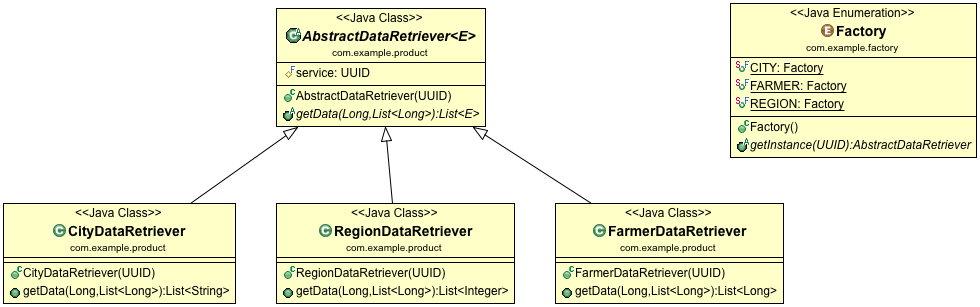

# Factory Method Design Pattern Example
Although this project is not based on any particular tutorial, I mainly used the [Refactoring Guru](https://refactoring.guru/design-patterns/factory-method) explanation as reference when implementing the code.

## Project Overview

There is no GUI for this project as the goal is to understand the structure. 

There are classes (_products_) representing a set of data operations for different entities. These classes are parameterised to use a type of service (service1, service2, service3, ...) and work with a type of entity (String, Long, Integer, ...).

The _factory_ enum creates instances of _products_, which can be used to retrieve data by calling `getData()` method. 

Please notice that I used an Enum as a factory instead of subclasses as the original definition sets. 

Check the test class to see the code in action.

## Class Structure



There are two packages: `factory` and `product`. The `factory` package was initially created to group subclasses that act as factories.

The `product` package groups the abstract and concrete _product_ classes.

* `AbstractDataRetriever` is the abstraction used to define a product. It has a constructor that receives a service and a method that retrieves the data;

* `CityDataRetriever`, `FarmerDataRetriever` & `RegionDataRetriever` are concrete implementations of a _product_. 

## Project Setup
```
mvn clean test
```
