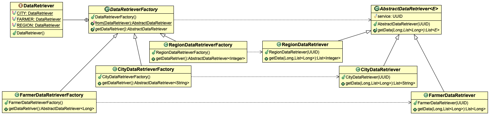

# Factory Method Design Pattern Example
Although this project is not based on any particular tutorial, I mainly used the [Refactoring Guru](https://refactoring.guru/design-patterns/factory-method) explanation as reference when implementing the code.

## Project Overview

There are classes (_products_) representing a set of data operations for different entities. These classes are parameterised to use a type of service (service1, service2, service3, ...) and work with a type of entity (String, Long, Integer, ...). _Product_ classes extend `AbstractDataRetriever`, which sets the common behaviour expected by _data retriever_ classes (`getData(List<E>)`).

_Creator_ classes extend `DataRetrieverFactory`, which sets the `getDataRetriever(): AbstractDataRetriever<E>` method. The method is responsible for creating _concrete products_. Each subclass of `DataRetrieverFactory` depends on a subclass of `AbstractDataRetriever<E>`.

`DataRetrieverFactory.from(DataRetriever): AbstractDataRetriever` is an auxiliary method that instantiate classes based on an argument. Althoug this is not part of the original structure, it is an usual extension used by many developers.

Check out the test class to see the code in action.

## Class Structure



There are two packages: `factory` and `product`. The `factory` package groups subclasses that act as factories (left-hand side). The `product` package groups abstract and concrete _product_ classes (righ-hand side).

* `AbstractDataRetriever` is the abstraction used to define a product. It has a constructor that receives a service and a method that retrieves the data;

* `CityDataRetriever`, `FarmerDataRetriever` & `RegionDataRetriever` are concrete implementations of a _product_. 

* `DataRetrieverFactory` sets the method that creates an instance of a _product_. In addition, it carries a _factory method_ that is a usual extension to the Factory DP.

* `FarmerDataRetrieverFactory`, `CityDataRetrieverFactory`, and `RegionDataRetrieverFactory` instantiate _concrete products_.

## Flow Structure


The Figure shows the test execution for three services. Notice the sequence diagram shows only the abstraction, not the concrete implementations. Three factories are created from `from()` method. Similarly, three `getData()` calls are made to instances of `AbstractDataRetriever`.

## Project Setup
```
mvn clean test
```
